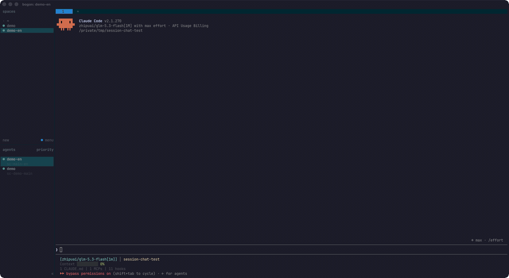
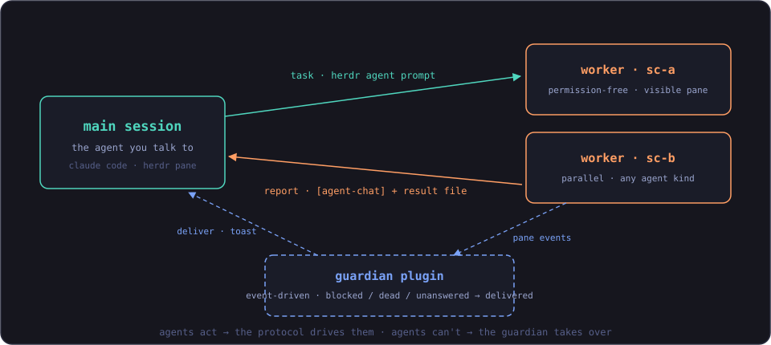

# herdr-agent-chat

<div align="center">
  <a href="LICENSE"></a>
  
  <a href="https://herdr.dev/plugins/"></a>
  
  ·
  <a href="README.zh-CN.md">简体中文</a>
</div>

**Chat-like delegation between terminal agents running in [Herdr](https://herdr.dev).** Your main session spawns permission-free worker sessions in sibling panes, hands them tasks, and keeps talking to you — workers report back over the same channel when they're done. **Nobody blocks.**



## Why not built-in subagents?

| | built-in subagents | herdr-agent-chat workers |
|---|---|---|
| Visibility | ✗ hidden | ✓ a real pane you can watch — and jump into at any time |
| Lifetime | ✗ one-shot | ✓ persistent sessions — send follow-ups to the same worker |
| Environment | ✗ sandboxed, no skills/hooks/MCP | ✓ a full agent with your global skills, hooks and MCP servers |
| Result | ✗ a report squeezed into the caller | ✓ files on disk + a message, with a guardian that guarantees delivery |

## Install

```bash
# 1/2 — the protocol (skill, required)
npx skills add GODVvVZzz/herdr-agent-chat --skill herdr-agent-chat -g

# 2/2 — the guardian (plugin, recommended — delivery guarantee)
herdr plugin install GODVvVZzz/herdr-agent-chat/plugin
```

The plugin works without the skill (it only reacts to panes listed in an
agent-chat manifest), and the skill works without the plugin (workers then
deliver their own replies) — but the two together are the intended setup.

Requirements: Herdr ≥ 0.9.0, Claude Code as the main session (workers can be
any Herdr-supported agent kind), macOS or Linux.

## How it works

<div align="center">
  
</div>

One boundary rule: **while an agent can act, the protocol drives it; when it
cannot — blocked, dead, or silent — the guardian plugin takes over.**

- `skills/herdr-agent-chat/SKILL.md` — the protocol as agent instructions:
  non-blocking dispatch, literal-address replies, a dispatch registry
  (`manifest.json`), delivery receipts, blocked-dialog classification
  (mechanical → answer with least privilege; substantive → ask the human),
  death handling (report, never respawn on its own).
- `plugin/` — a Herdr plugin subscribed to `pane.agent_status_changed`,
  `pane.exited`, `pane.closed`. It forwards blocked workers to the main
  session, delivers receipts that workers could not deliver themselves
  (deduplicated by content hash), reports dead workers, and toasts the human
  via `herdr notification show`. One event-driven process, no polling, zero
  actions on unrelated panes.
- `protocol.md` — the full wire and file contract, including what it takes to
  port workers to other agent kinds (codex, pi, opencode, …).

The plugin is optional: without it, workers deliver their own replies and the
main session's health checks catch stuck workers. With it, delivery is
guaranteed even when a worker is blocked, dies, or forgets.

## Usage

Inside Herdr, just tell your main session what to delegate:

> dispatch these two tasks to workers and report back when they're done

The main session will split panes, start workers, dispatch, and keep chatting
with you. Worker replies arrive as `[agent-chat] …` messages and each one is
verified against its result file before being summarized to you. Progress
questions ("how far along is it?") are answered from the dispatch registry
without waiting on anyone.

## Status

- The full protocol is validated end-to-end on Herdr 0.9.0 with Claude Code
  workers: single and parallel dispatch, interleaved replies, queued replies,
  multi-turn follow-ups, progress queries, worker death, and blocked-dialog
  handling.
- The guardian's delivery path (receipt → deliver → archive → wake main) is
  validated end-to-end; blocked/death forwarding use the same event and
  delivery mechanism.
- The protocol itself is CLI-independent; unattended launch flags for codex,
  pi and opencode are documented in `protocol.md` and should be verified on
  your machine before relying on them.

## License

MIT
