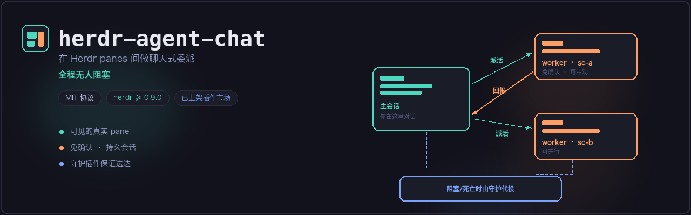
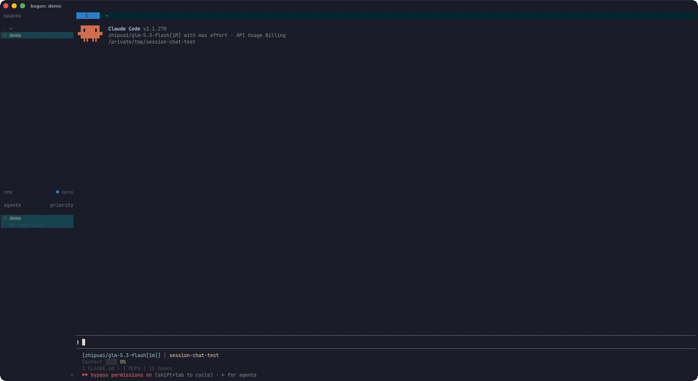
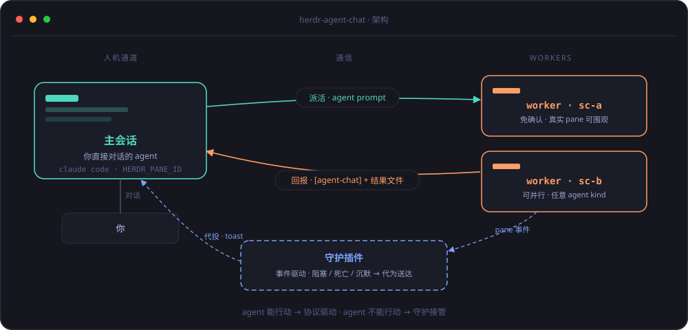

<div align="center">
  <a href="README.md">English</a> · <strong>简体中文</strong>
</div>

<div align="center">
  
</div>

<h1 align="center">herdr-agent-chat</h1>

<div align="center">
  <a href="LICENSE"></a>
  
  <a href="https://herdr.dev/plugins/"></a>
  
</div>

**在 [Herdr](https://herdr.dev) 里实现终端 agent 之间的聊天式委派。** 主会话在兄弟 pane 里拉起免确认的 worker 子会话(任务属于别的项目时,也可以直接去那个 workspace 开新 tab)、把任务发过去,然后继续和你对话——worker 干完活经同一通道回报,全程无人阻塞。



## 为什么不用内置 subagent?

| | 内置 subagent | herdr-agent-chat worker |
|---|---|---|
| 可见性 | ✗ 隐藏运行 | ✓ 真实 pane,随时围观、随时插话接管 |
| 生命周期 | ✗ 一次性 | ✓ 持久会话——同一 worker 可以多轮追问 |
| 环境 | ✗ 受限,不带 skills/hooks/MCP | ✓ 完整 agent,自带你的全局 skills、hooks 和 MCP |
| 结果 | ✗ 一份报告塞回调用方 | ✓ 文件落盘 + 消息通知,守护插件保证送达 |

## 安装

```bash
# 1/2 — 协议(skill,必需)
npx skills add GODVvVZzz/herdr-agent-chat --skill herdr-agent-chat -g

# 2/2 — 守护(插件,推荐——投递保证)
herdr plugin install GODVvVZzz/herdr-agent-chat/plugin
```

插件可以在没有 skill 的情况下工作(只响应 agent-chat manifest 里登记的 pane),skill 也可以在没有插件的情况下工作(worker 自己投递回信)——但两个一起装才是完整形态。

环境要求:Herdr ≥ 0.9.0,主会话为 Claude Code(worker 可以是 Herdr 支持的任意 agent kind),macOS 或 Linux。

## 工作原理

<div align="center">
  
</div>

一条边界规则:**agent 能行动时,协议驱动它;agent 不能行动时——阻塞、死亡、沉默——守护插件接管。**

- `skills/herdr-agent-chat/SKILL.md` — 以 agent 指令形式呈现的协议:非阻塞派发、字面值回信地址、派发登记表(`manifest.json`)、投递签收单、阻塞弹窗分类处理(机械 → 最小授权代按;实质 → 请示人)、死亡处理(如实上报,绝不擅自重派)。
- `plugin/` — 订阅 `pane.agent_status_changed`、`pane.exited`、`pane.closed` 的 Herdr 插件。它把被阻塞的 worker 转发给主会话、代投 worker 未能送出的回信(按内容哈希去重)、上报死亡的 worker,并通过 `herdr notification show` 向人发 toast。单进程、事件驱动、零轮询,对无关 pane 零动作。
- `protocol.md` — 完整的线上与文件契约,包括移植到其他 agent kind(codex、pi、opencode 等)所需的全部内容。

插件是可选的:没有它,worker 自己投递回信,主会话的周期体检兜住卡住的 worker;有了它,无论 worker 阻塞、死亡还是遗忘,投递都有保证。

## 使用

在 Herdr 里,直接对主会话说人话:

> 把这两个测试任务派出去,跑完告诉我结果

主会话会自动切分 pane、拉起 worker、派发任务,然后继续和你聊天。worker 的回信以 `[agent-chat] …` 消息到达,每一条都会先和结果文件核实再向你简报。进度问题("跑到哪了")直接查派发登记表回答,不等任何人。

## 状态

- 完整协议已在 Herdr 0.9.0 + Claude Code worker 上端到端实测:单发与并行派发、回信交错、回信排队、多轮追问、进度查询、worker 死亡、阻塞弹窗处理。
- 守护插件的投递路径(签收单 → 代投 → 归档 → 唤醒主会话)已端到端实测;阻塞/死亡转发使用同一事件与投递机制。
- 协议本身与 CLI 无关;codex、pi、opencode 的免确认启动 flag 已在 `protocol.md` 文档化,依赖前请先在你的机器上验证。

## 许可

MIT
